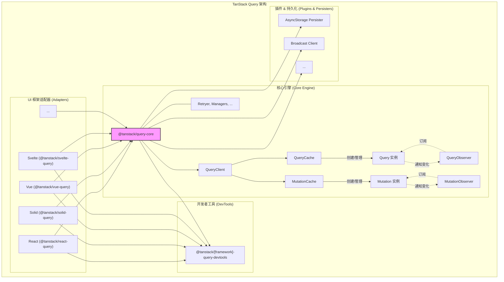
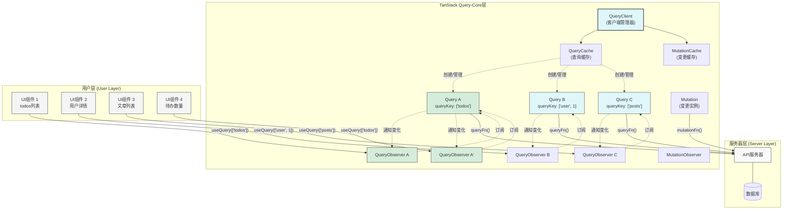

# 一、引言与基础 (Introduction & Basics)

## 1.1 TanStack Query 概述

TanStack Query (原名 React Query) 是一个强大的异步状态管理库，专门用于简化获取、缓存、同步和更新**服务器状态**的过程。服务器状态通常指那些需要从后端 API 获取并在前端进行管理的数据。

**核心优势**:

- **简化数据获取**: TanStack Query 将复杂的数据获取逻辑（如加载状态、错误处理、重试）与 UI 组件解耦，开发者只需声明所需数据即可。
- **智能缓存管理**: 内置强大的缓存机制，如 "stale-while-revalidate" 策略。它会优先展示缓存数据（提升感知速度），同时在后台检查并获取最新数据，优化用户体验和应用性能。
- **后台自动更新**: 能够在后台静默地检查数据是否过期，并在合适的时机（如窗口重新聚焦、网络重连、固定时间间隔）自动更新，确保数据的相对新鲜度。
- **与框架无关**: 其核心引擎 (`@tanstack/query-core`) 是一个独立的包，可以与 React, Solid, Vue, Svelte 等多种前端框架或原生 JavaScript 配合使用。
- **优秀的开发体验**: 提供 TanStack Query DevTools，这是一个可视化工具，可以方便地检查查询状态、数据和缓存内容，极大地简化了调试过程。
- **减少模板代码**: 自动化处理了传统数据获取中常见的加载、错误、缓存、同步等状态管理，使开发者能更专注于业务逻辑。

## 1.2 `@tanstack/query-core`：核心引擎

`@tanstack/query-core` 是 TanStack Query 的核心引擎，包含了所有与 UI 框架无关的基础逻辑和状态管理机制。你可以将其视为库的"大脑"或"中央处理器"。

- **角色**: 一个纯粹的、与界面无关的状态管理内核 (有时称为 "headless" 核心)。
- **作用**:
  - 实现了所有核心功能：管理数据请求 (`Query`)、数据修改操作 (`Mutation`)、缓存 (`QueryCache`, `MutationCache`)、状态更新、后台重新获取、垃圾回收等。
  - 是所有框架适配器（如 `@tanstack/react-query`, `@tanstack/vue-query`）的基础。这些适配器将 `query-core` 的能力与特定框架的响应式系统和生命周期相结合。

## 1.3 整体架构与核心模块

TanStack Query 采用了清晰的分层设计：

- **核心层 (`@tanstack/query-core`)**: 负责所有平台无关的底层逻辑和状态管理。
- **适配器层 (`@tanstack/[framework]-query`)**: 为特定前端框架（如 React, Vue）提供封装，将核心功能与框架的特性（如 Hooks, Composition API）集成，提供更符合框架习惯的 API。

`@tanstack/query-core` 主要由以下模块构成：

- `QueryClient`: **核心管理器**。作为配置中心和 API 入口，管理全局配置及下属的 `QueryCache` 和 `MutationCache` 实例。通常在应用中创建单个实例。
- `QueryCache`: **查询缓存**。负责存储和管理应用中所有的 `Query` 实例。
- `MutationCache`: **变更缓存**。负责存储和管理应用中所有的 `Mutation` 实例。
- `Query`: **查询单元**。代表一个独立的异步数据查询任务，包含其状态（`status`, `fetchStatus`）、数据、元数据以及获取数据的函数 (`queryFn`) 和配置。
- `Mutation`: **变更单元**。代表一个独立的异步数据修改操作（如 POST, PUT, DELETE），包含其状态和执行逻辑 (`mutationFn`)。
- `QueryObserver`: **查询观察者**。连接一个或多个 `Query` 实例与最终的订阅者（通常是 UI 组件）。当 `Query` 状态变化时，`QueryObserver` 计算出最新的结果 (`data`, `status`, `isFetching` 等) 并通知订阅者更新。

下图展示了 TanStack Query 的核心组件如何协同工作，从用户界面的数据请求（通过适配器如 `useQuery`）到 `QueryObserver` 监听 `Query` 状态，再到 `Query` 通过 `queryFn` 从后端 API 获取数据，以及变更操作 (`Mutation`) 的流程：

- `Retryer`: **重试处理器**。封装了处理查询或变更失败时的自动重试逻辑，支持配置重试次数和延迟。
- `NotifyManager`: **通知管理器**。通过批处理（batching）优化状态更新通知，将短时间内的多个通知合并处理，减少不必要的重复渲染。
- `FocusManager`, `OnlineManager`: **环境状态管理器**。分别监测浏览器窗口/标签页的焦点状态和网络的在线状态。当状态变化时（如窗口聚焦、网络恢复），可以触发数据的自动重新获取。

**与前端框架的集成**: `query-core` 通过适配器层与前端框架集成。例如，React 中的 `useQuery` Hook 内部会创建并管理一个 `QueryObserver` 实例。该 `QueryObserver` 订阅 `query-core` 中相应 `Query` 的状态变化。当 `Query` 状态更新时，`QueryObserver` 接收通知，计算新结果，并将这些结果传递给 React 组件，触发重新渲染。这种设计保证了核心逻辑的可重用性和框架无关性。

## 1.4 核心设计模式

TanStack Query 的实现中运用了多种经典设计模式：

- **观察者模式 (Observer Pattern)**: `QueryObserver` 是此模式的核心体现。`Query` 实例是被观察者（Subject），当其状态变化时，会通知所有订阅它的 `QueryObserver`（Observer）。`QueryObserver` 随后处理并通知最终的订阅者（如 UI 组件）。
- **发布-订阅模式 (Publish-Subscribe Pattern)**: 在缓存 (`QueryCache`, `MutationCache`) 和管理器 (`NotifyManager`, `FocusManager`, `OnlineManager`) 中广泛使用。组件或模块可以向某个中心（如 `QueryCache` 的事件系统）发布事件（如查询更新），而其他订阅了该事件的组件或模块则会收到通知，实现了模块间的解耦。`NotifyManager` 使用此模式调度和批量处理通知。
- **状态模式 (State Pattern)**: `Query` 和 `Mutation` 内部维护着复杂的状态机。例如，`Query` 有 `status` (数据状态：`pending`, `error`, `success`) 和 `fetchStatus` (请求状态：`fetching`, `paused`, `idle`)。对象的行为会根据其当前状态而变化。
- **策略模式 (Strategy Pattern)**: 体现在可配置的行为上。例如，通过组合不同的 `gcTime` (垃圾回收时间) 和 `staleTime` (数据被视为陈旧的时间)，可以选择不同的缓存和更新策略。`retryDelay`（重试延迟）选项允许传入函数，自定义重试间隔的计算策略。

## 1.5 `query-core` 源码结构

`@tanstack/query-core` 的主要源代码位于 `packages/query-core/src/` 目录。了解核心文件的职责有助于深入理解其工作原理：

- `queryClient.ts`: 定义核心 `QueryClient` 类，是应用的入口点和配置中心，管理 `QueryCache` 和 `MutationCache`，并提供主要的 API 方法（如 `fetchQuery`, `invalidateQueries`, `setQueryData` 等）。
- `queryCache.ts`: 定义 `QueryCache` 类，负责管理所有 `Query` 实例的生命周期（创建、存储、查找、移除）和事件通知。
- `mutationCache.ts`: 定义 `MutationCache` 类，负责管理所有 `Mutation` 实例的生命周期和事件通知，并控制变更的执行顺序。
- `query.ts`: 定义 `Query` 类，代表一个独立的查询任务，包含其 `queryKey`, `queryHash`, `options`, `state` (状态)，并管理数据获取 (`fetch`) 和状态转换逻辑。
- `mutation.ts`: 定义 `Mutation` 类，代表一个独立的变更操作，包含其 `mutationId`, `options`, `state`，并管理其执行 (`execute`) 和状态转换逻辑。
- `queryObserver.ts`: 定义 `QueryObserver` 类，连接 `Query` 状态与订阅者（通常是 UI Hooks），负责监听 `Query` 变化、计算并派发结果给订阅者。
- `mutationObserver.ts`: 定义 `MutationObserver` 类，用于观察单个 `Mutation` 的状态，并将结果通知给订阅者。
- `infiniteQueryObserver.ts`: 继承自 `QueryObserver`，专门处理无限滚动/分页加载场景的逻辑，提供了 `fetchNextPage` 和 `fetchPreviousPage` 等方法。
- `retryer.ts`: 导出 `createRetryer` 函数，用于创建管理异步操作（如 `queryFn`, `mutationFn`）重试逻辑的 `Retryer` 对象，处理重试、延迟、取消等。
- `notifyManager.ts`: 导出单例 `notifyManager`，用于调度和批量处理状态更新通知，通过 `schedule` 和 `batch` 方法优化性能。
- `focusManager.ts`: 导出单例 `focusManager`，管理和广播浏览器窗口/标签页的焦点状态，用于触发 `refetchOnWindowFocus`。
- `onlineManager.ts`: 导出单例 `onlineManager`，管理和广播网络连接状态，用于触发 `refetchOnReconnect`。
- `subscribable.ts`: 定义基础的 `Subscribable` 类，提供通用的发布-订阅机制，被 `QueryCache`, `MutationCache`, `FocusManager`, `OnlineManager` 等使用。
- `utils.ts`: 包含各种内部使用的工具函数，如 `isServer`, `functionalUpdate`, `hashQueryKeyByOptions`, `matchQuery`, `shallowEqualObjects` 等。
- `types.ts`: 包含库使用的 TypeScript 类型定义。
- `hydration.ts`: 提供 `hydrate` 和 `dehydrate` 函数，用于服务器端渲染 (SSR) 和持久化场景下，在不同环境间传递和恢复缓存状态。
- `removable.ts`: 定义抽象基类 `Removable`，为 `Query` 和 `Mutation` 提供垃圾回收 (GC) 的调度逻辑 (`scheduleGc`, `clearGcTimeout`)。
- `thenable.ts`: 提供与 React Suspense 兼容的 `pendingThenable` 实现，用于在数据加载时挂起组件。
- `infiniteQueryBehavior.ts`: 导出 `infiniteQueryBehavior` 函数，定义了处理无限查询时计算下一页/上一页数据和判断是否存在更多页 (`hasNextPage`, `hasPreviousPage`) 的逻辑。
- `queriesObserver.ts`: 定义 `QueriesObserver` 类，用于同时观察多个查询的状态。
- `streamedQuery.ts`: 导出 `streamedQuery` 辅助函数，用于创建能够处理 AsyncIterable (流式数据源) 的查询。

理解这些核心文件的职责，将有助于后续更深入地探索 TanStack Query 的源码。
