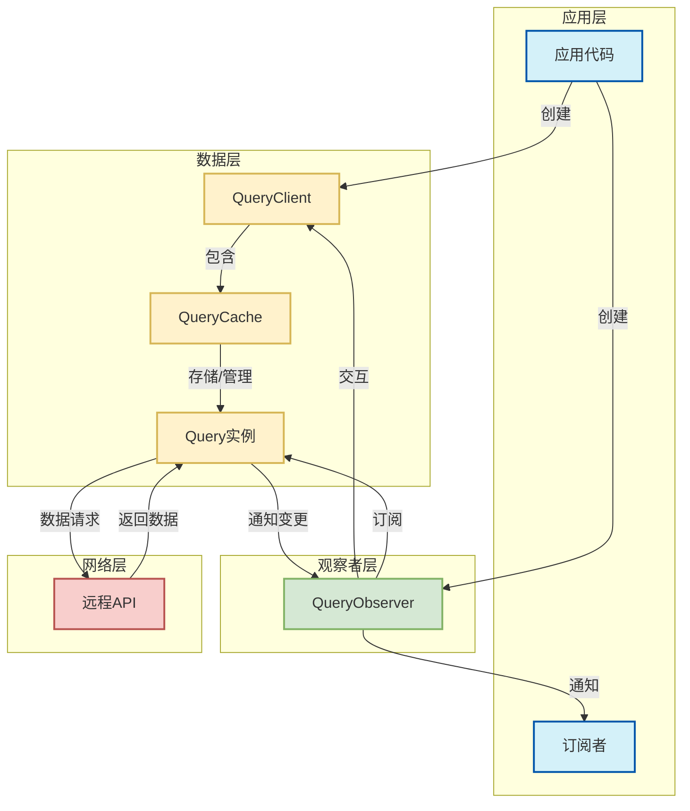
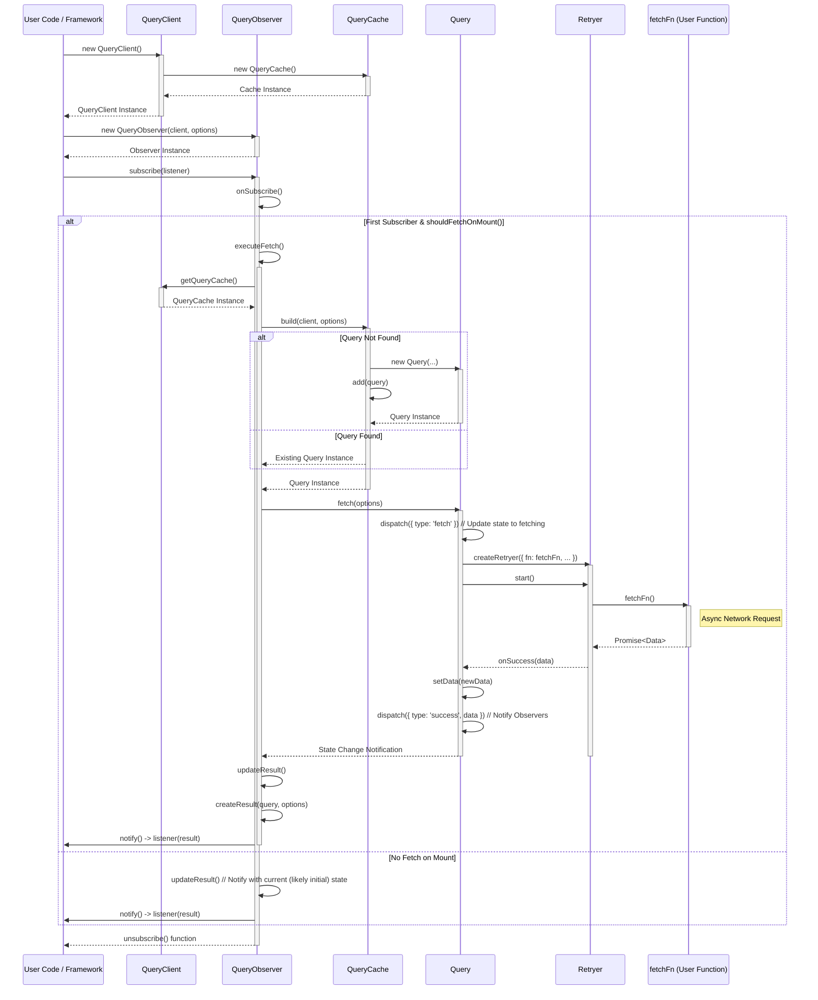

# 2.0 Query Core 概览

## 数据流程图



## 源码执行流程解析

我们通过跟踪一个完整的数据获取周期，来解析 TanStack Query 核心源码的执行过程。以下展示了从初始化到数据获取的关键步骤：

### 1. 创建 QueryClient 与初始化

```typescript
// 创建查询客户端实例
const queryClient = new QueryClient({
  defaultOptions: {
    queries: {
      staleTime: 60000,
      gcTime: 300000,
    },
  },
})

// 内部执行过程 (简化)
class QueryClient {
  #queryCache: QueryCache
  #mutationCache: MutationCache
  #defaultOptions: DefaultOptions

  constructor(config = {}) {
    this.#queryCache = config.queryCache || new QueryCache()
    this.#mutationCache = config.mutationCache || new MutationCache()
    this.#defaultOptions = config.defaultOptions || {}
    this.#queryDefaults = new Map()
    this.#mutationDefaults = new Map()
    this.#mountCount = 0
  }

  // ... 其他方法 (省略)
}
```

**执行过程**:

1. 创建空的 `QueryCache` 和 `MutationCache` 实例
2. 存储默认配置，将应用于所有查询
3. 初始化内部数据结构，为后续操作做准备

### 2. 创建 QueryObserver 并设置查询

```typescript
// 创建查询观察者
const observer = new QueryObserver(queryClient, {
  queryKey: ['todos'],
  queryFn: () => fetch('/api/todos').then((res) => res.json()),
  staleTime: 60000,
  gcTime: 300000,
})

// 内部执行过程 (简化)
class QueryObserver extends Subscribable {
  #client: QueryClient
  #currentQuery: Query
  #currentResult: QueryObserverResult
  #currentThenable: Thenable<TData> // 用于异步结果追踪
  #selectError: Error | null

  constructor(client, options) {
    super()
    this.#client = client
    this.#currentThenable = pendingThenable()
    this.#selectError = null

    // 绑定this指向
    this.bindMethods()
    // 设置初始选项并创建查询对象
    this.setOptions(options)
  }
}
```

**执行过程**:

1. 创建 `QueryObserver` 实例，继承自 `Subscribable`
2. 初始化 `#client` 等属性
3. 绑定 `refetch` 等实例方法 (`bindMethods`)
4. 调用 `setOptions` 方法应用默认选项并更新查询实例。**注意：在此阶段，`setOptions` 主要负责初始化和关联 `Query` 实例，通常不会直接触发首次数据获取，因为还没有订阅者。**

### 3. 订阅查询结果，触发查询创建

```typescript
// 订阅查询结果
const unsubscribe = observer.subscribe((result) => {
  const { status, data, error } = result
  // 处理查询结果...
})

// 内部执行过程 (简化)
class QueryObserver {
  // ... 构造函数等 (省略)

  protected onSubscribe(): void {
    // 首次有订阅者时才开始工作
    if (this.listeners.size === 1) {
      this.#currentQuery.addObserver(this)

      // 检查是否需要立即请求数据
      if (shouldFetchOnMount(this.#currentQuery, this.options)) {
        this.#executeFetch()
      } else {
        // 即使不请求数据也要通知当前状态
        this.updateResult()
      }
    }
  }

  subscribe(listener): () => void {
    this.listeners.add(listener)
    this.onSubscribe()

    // 返回取消订阅函数
    return () => {
      this.listeners.delete(listener)
      this.onUnsubscribe()
    }
  }
}
```

**执行过程**:

1. 调用 `subscribe` 方法添加结果监听器
2. 当首次添加监听器时，执行 `onSubscribe` 方法：
   - 将观察者添加到查询实例
   - **检查 `shouldFetchOnMount` 条件，如果满足（通常对于一个启用的、无数据的查询），则调用 `#executeFetch()` 开始首次数据获取。**
3. 返回取消订阅函数，用于后续移除监听器

### 4. 查询创建与缓存查找

```typescript
// 执行获取的内部实现 (简化)
class QueryObserver {
  // ... 其他方法 (省略)

  #executeFetch(
    fetchOptions?: ObserverFetchOptions,
  ): Promise<TQueryData | undefined> {
    // 更新查询实例引用
    this.#updateQuery()
    // 调用查询实例的fetch方法
    let promise = this.#currentQuery.fetch(this.options, fetchOptions)
    // 捕获错误以防止Promise链中断
    if (!fetchOptions?.throwOnError) {
      promise = promise.catch(noop)
    }
    return promise
  }

  #updateQuery(): void {
    // 从缓存获取或创建查询实例
    const query = this.#client.getQueryCache().build(this.#client, this.options)
    if (query === this.#currentQuery) {
      return
    }
    const prevQuery = this.#currentQuery
    this.#currentQuery = query
    // 如果有监听器，更新观察者注册
    if (this.hasListeners()) {
      prevQuery?.removeObserver(this)
      query.addObserver(this)
    }
  }
}

// 查询缓存的构建方法 (简化)
class QueryCache {
  #queries = new Map<string, Query>()

  build(client, options): Query {
    const queryKey = options.queryKey
    // 计算查询键的哈希值
    const queryHash =
      options.queryHash || hashQueryKeyByOptions(queryKey, options)
    // 检查缓存中是否已存在
    let query = this.get(queryHash)
    // 若不存在则创建新查询实例
    if (!query) {
      query = new Query({
        cache: this,
        queryKey,
        queryHash,
        options: client.defaultQueryOptions(options),
      })
      // 将新查询添加到缓存
      this.add(query)
    }
    return query
  }
}
```

**执行过程**:

1. 通过 `#updateQuery` 确保引用最新的查询实例：
   - 从 `QueryCache` 获取或创建查询
   - 更新观察者与查询之间的关系
2. 调用查询的 `fetch` 方法开始数据获取

### 5. 数据获取流程 - `fetch()` 方法执行

```typescript
// Query 实例的 fetch 方法被调用 (简化)
class Query {
  #retryer: Retryer | null
  #state: QueryState
  #revertState?: QueryState<TData, TError> // 用于取消回滚的状态

  fetch(options, fetchOptions): Promise<any> {
    // 检查是否已有请求在进行中
    if (this.#state.fetchStatus !== 'idle') {
      // ... 处理并发逻辑 (省略)
    }
    // 更新查询选项（如果传入了新选项）
    if (options) {
      this.setOptions(options)
    }

    // ... abortController
    // ... addSignalProperty

    // 包装用户查询函数
    const fetchFn = () => {
      // 确保获取有效的 queryFn (处理 skipToken 等)
      const queryFn = ensureQueryFn(this.options, fetchOptions)
      // 在 fetchFn 内部创建上下文
      const queryFnContext = {
        queryKey: this.queryKey,
        meta: this.options.meta,
      }
      // ... signal相关
      return queryFn(queryFnContext as QueryFunctionContext<TQueryKey>)
    }

    // 准备 onFetch 钩子的上下文
    const context = { fetchOptions, options: this.options /* ...其他属性 */ }

    // 触发查询前钩子函数
    this.options.behavior?.onFetch(
      context as FetchContext<TQueryFnData, TError, TData, TQueryKey>,
      this as unknown as Query,
    )

    // 存储当前状态，用于可能的取消回滚
    this.#revertState = this.state

    // 仅在必要时更新状态为 fetching
    if (/** 根据 fetchStatus 和 fetchMeta 判断 ... */) {
      this.#dispatch({ type: 'fetch', meta: context.fetchOptions?.meta })
    }

    // 创建错误处理函数
    const onError = (error) => {
      // ... 错误处理逻辑 (省略)
    }
    // 创建重试控制器
    this.#retryer = createRetryer({
      fn: fetchFn,
      onSuccess: (data) => {
        // ... 验证数据有效性 (省略)
        this.setData(data)
        // ... 触发缓存回调和调度GC (省略)
      },
      onError,
      // ... 其他重试选项 (省略)
    })
    // 开始执行请求并返回Promise
    return this.#retryer.start()
  }
}
```

**执行过程**:

1.  **检查是否有进行中的请求，处理并发逻辑 (代码已省略)。**
2.  **更新查询选项（如果传入了新选项）。**
3.  构建获取函数 (`fetchFn`)。在 `fetchFn` 内部创建上下文并获取 `queryFn`。
4.  准备并触发 `onFetch` 钩子（如果配置了 `behavior`）。
5.  存储当前状态到 `#revertState`，用于可能的取消回滚。
6.  检查当前状态，仅在必要时（基于 `fetchStatus` 和 `fetchMeta`）`dispatch` 一个 `fetch` action 来更新状态为 fetching (具体判断代码已省略)。
7.  创建并启动 `Retryer` 来管理实际的 `fetchFn` 调用、重试和状态更新（success/error）。

### 6. 请求成功处理 - 数据设置与通知

```typescript
// Retryer 成功后调用 Query.setData (简化)
class Query {
  // ... 其他方法 (省略)

  setData(newData, options): TData {
    // 使用不可变数据更新
    const data = replaceData(this.state.data, newData, this.options)
    this.#dispatch({
      data,
      type: 'success',
      dataUpdatedAt: options?.updatedAt,
      manual: options?.manual,
    })
    return data
  }
}

// 数据传播到 Observer 并触发监听器 (简化)
class QueryObserver {
  // ... 其他方法 (省略)

  // 在查询状态更新时重新生成结果对象并通知
  updateResult(notifyOptions?: NotifyOptions): void {
    // ... 获取旧结果 (省略)
    // const prevResult = this.#currentResult

    // 根据最新查询状态创建新结果
    const nextResult = this.createResult(this.#currentQuery, this.options)

    // ... 更新内部状态引用 (省略)
    // this.#currentResultState = ...
    // this.#currentResultOptions = ...

    // ... 更新最近有数据的查询引用 (省略)

    // ... 检查结果是否有变化 (省略)
    // if (shallowEqualObjects(nextResult, prevResult)) { return }

    // 更新当前结果对象
    this.#currentResult = nextResult

    // ... 准备默认通知选项 (省略)

    // 判断是否需要通知监听器 (基于配置和变化)
    const shouldNotifyListeners = (): boolean => {
      // ... 复杂的判断逻辑 (省略)
      return true // 简化的返回值
    }

    // ... 根据判断结果设置通知选项 (省略)
    // if (notifyOptions?.listeners !== false && shouldNotifyListeners()) { ... }

    // 调用通知方法，触发所有监听器 (如果需要)
    this.#notify({
      /* ... 合并后的通知选项 ... */
    })
  }

  // 构建结果对象 (简化)
  protected createResult(query, options): QueryObserverResult {
    // 1. 获取之前的 Query, Options, Result 等用于比较和优化 (省略)
    // ...

    // 2. 获取当前查询状态，并根据 optimisticResults 配置进行潜在调整，得到基础状态 newState
    const { state } = query
    let newState = { ...state }
    let isPlaceholderData = false
    let data: TData | undefined

    if (options._optimisticResults) {
      // ... 乐观结果逻辑，修改 newState (省略)
    }

    // 3. 从调整后的 newState 中解构出部分基础状态
    let { error, errorUpdatedAt, status } = newState

    // 4. 处理数据: select 转换 / placeholder 数据 (此过程可能修改 data 等)
    if (options.select && newState.data !== undefined) {
      // ... select 数据转换逻辑，可能设置 data 和 #selectError (省略)
    } else {
      data = newState.data as unknown as TData
    }

    if (
      options.placeholderData !== undefined &&
      data === undefined &&
      status === 'pending'
    ) {
      // ... placeholder 数据处理逻辑
    }

    // 5. 处理 select 过程中可能发生的错误 (#selectError)
    if (this.#selectError) {
      // ...
    }

    // 6. 计算最终的派生状态标志 (isFetching 等)
    // ... 派生状态计算逻辑 (省略)

    // 7. 组装并返回最终结果对象
    return {
      status,
      fetchStatus: newState.fetchStatus,
      data,
      error,
      dataUpdatedAt: newState.dataUpdatedAt,
      errorUpdatedAt,
      // ... 各种派生状态标志 (省略)
      isStale: isStale(query, options),
      refetch: this.refetch,
      // ... 其他属性 (省略)
    }
  }
}
```

**执行过程**:

1. 当查询获取到新数据时，`Query.setData` 被调用
   - 应用可选的数据选择器并检查数据变化
   - 更新查询状态并通知所有观察者
2. 当查询状态变化时，`QueryObserver.updateResult` 被调用
   - 创建新的结果对象
   - 更新当前结果并通知监听器
3. 创建新的结果对象包含所有关键状态信息：
   - `status`, `data`, `error`, `fetchStatus` 等基本信息
   - `isPending`, `isSuccess`, `isError` 等派生状态
   - `refetch` 方法用于手动重新获取数据

## 数据获取时序图


