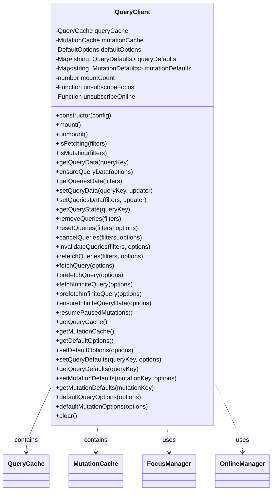

# 2.1 `QueryClient` 基础

`QueryClient` 是 TanStack Query 库的中央协调器。你可以把它看作是配置中心、缓存管理者以及与库交互的主要 API 接口。在一个典型的应用中，通常会创建一个 `QueryClient` 实例，并在整个应用范围内共享使用。

## 2.1.1 职责与作用

`QueryClient` 的核心职责包括：

1.  **配置中心**:

    - 保存全局默认配置 (`defaultOptions`)，这些配置会作为所有查询和变更的基础设定，除非在具体调用时被覆盖。
    - 允许通过 `setQueryDefaults` 和 `setMutationDefaults` 方法为特定的查询键 (`QueryKey`) 或变更键 (`MutationKey`) 设置更具体的默认配置，提供了灵活的层级配置能力。

2.  **缓存管理器**:

    - 持有 `QueryCache` 和 `MutationCache` 的实例。`QueryClient` 不直接存储查询 (`Query`) 或变更 (`Mutation`) 实例，而是将管理工作委托给这两个专门的缓存类。
    - 通过 `getQueryCache()` 和 `getMutationCache()` 方法可以访问这两个缓存实例。

3.  **API 入口**:

    - 提供了一系列方法让开发者与 TanStack Query 互动，如触发数据获取 (`fetchQuery`, `prefetchQuery`)、管理缓存数据 (`getQueryData`, `setQueryData`, `invalidateQueries`)、获取当前状态 (`isFetching`, `isMutating`, `getQueryState`) 等。这些 API 封装了与底层缓存及查询/变更对象的交互细节。

4.  **全局事件协调**:
    - 通过 `mount()` 和 `unmount()` 方法，管理与浏览器窗口聚焦 (`focusManager`)、网络状态变化 (`onlineManager`) 等全局事件监听器的连接。当窗口获得焦点或网络恢复在线时，`QueryClient` 会协调 `QueryCache` 触发必要的后台数据刷新（基于 `refetchOnWindowFocus`, `refetchOnReconnect` 配置）并恢复暂停的 Mutations。

这些核心 API 提供了与 TanStack Query 交互的强大能力，让开发者能够灵活地控制数据获取、缓存行为和状态同步。

以下是 `QueryClient` 的完整类图表示：



## 2.1.2 实例化与核心配置项分析

可以通过 `new QueryClient(config)` 来创建 `QueryClient` 实例，`config` 是一个可选的 `QueryClientConfig` 对象。下面是构造函数的源码及其解析：

```typescript
// packages/query-core/src/queryClient.ts
export class QueryClient {
  #queryCache: QueryCache
  #mutationCache: MutationCache
  #defaultOptions: DefaultOptions
  #queryDefaults: Map<string, QueryDefaults>
  #mutationDefaults: Map<string, MutationDefaults>
  #mountCount: number
  // #unsubscribeFocus, #unsubscribeOnline ... (用于管理全局事件订阅)

  constructor(config: QueryClientConfig = {}) {
    // 1. 初始化 QueryCache:
    //    如果用户在配置中提供了 queryCache 实例，则使用它。
    //    否则，创建一个新的默认 QueryCache 实例。
    this.#queryCache = config.queryCache || new QueryCache()

    // 2. 初始化 MutationCache:
    //    逻辑与 QueryCache 类似。
    this.#mutationCache = config.mutationCache || new MutationCache()

    // 3. 初始化全局默认选项:
    //    存储用户提供的 defaultOptions，如果未提供则为空对象。
    this.#defaultOptions = config.defaultOptions || {}

    // 4. 初始化特定 Key 的默认选项存储:
    //    创建空的 Map 用于后续存储 setQueryDefaults 和 setMutationDefaults 设置的选项。
    this.#queryDefaults = new Map()
    this.#mutationDefaults = new Map()

    // 5. 初始化挂载计数器:
    //    初始化为 0，用于 `mount`/`unmount` 方法管理全局事件监听器的订阅状态。
    this.#mountCount = 0
  }

  // ... mount, unmount, defaultQueryOptions, setQueryDefaults 等方法 ...
}
```

**源码解析**:

- **依赖注入/默认实例**: 构造函数允许开发者传入自定义的 `QueryCache` 和 `MutationCache` 实例。这提供了高级定制的可能性，例如可以实现自定义的缓存策略或持久化逻辑。如果没有提供，`QueryClient` 会自动创建默认的缓存实例，满足大多数使用场景。
- **默认选项存储**: `defaultOptions` 被直接存储在 `#defaultOptions` 属性中。这个对象将在后续的 `defaultQueryOptions` 和 `defaultMutationOptions` 方法中被用作配置合并的基础。
- **特定 Key 默认选项的容器**: `#queryDefaults` 和 `#mutationDefaults` 被初始化为空 `Map`。这两个 `Map` 会在调用 `setQueryDefaults` 和 `setMutationDefaults` 时被填充，键通常是 `queryKey` 或 `mutationKey` 的字符串哈希，值是对应的默认选项对象。
- **挂载计数 (`#mountCount`)**: 初始化为 0。此计数器用于 `mount` 和 `unmount` 方法中，通过引用计数来管理全局事件监听器（如 `focusManager`, `onlineManager`）的订阅与取消订阅。详细机制将在 2.1.3 节中解析。

**核心配置项 (`QueryClientConfig`)**:

- `queryCache`: 可选。传入自定义的 `QueryCache` 实例。若不提供，则自动创建默认实例。
- `mutationCache`: 可选。传入自定义的 `MutationCache` 实例。若不提供，则自动创建默认实例。
- `defaultOptions`: 可选。包含全局默认查询 (`queries`) 和变更 (`mutations`) 选项的对象。
  - `queries`: 应用于所有查询的默认选项，如 `staleTime`, `gcTime`, `retry`, `refetchOnWindowFocus` 等。
  - `mutations`: 应用于所有变更的默认选项，如 `retry`, `onError` 等。

**默认选项管理机制**:

`QueryClient` 提供了层级化的默认选项机制：

1.  **全局默认选项**: 在实例化时通过 `config.defaultOptions` 设置，或之后通过 `client.setDefaultOptions(options)` 修改。优先级最低。
2.  **特定 Key 的默认选项**:
    - `client.setQueryDefaults(queryKey, options)`: 为匹配 `queryKey` 的查询设置默认选项（支持部分匹配）。
    - `client.setMutationDefaults(mutationKey, options)`: 为匹配 `mutationKey` 的变更设置默认选项（支持部分匹配）。
    - 这些选项优先级高于全局默认选项。
3.  **直接传入选项**: 在调用具体方法 (如 `useQuery`, `fetchQuery`) 时传入的选项，优先级最高。

**优先级总结**: 直接传入选项 > 特定 Key 默认选项 > 全局默认选项。

`QueryClient` 的 `defaultQueryOptions` 或 `defaultMutationOptions` 方法负责将这三层选项按优先级合并，得到最终生效的配置。具体的合并逻辑和源码实现将在 2.8.1 节中详细分析。

这种分层配置使得开发者可以设定全局规则，同时对特定场景进行精细调整。

### 2.1.3 全局事件协调与生命周期 (`mount`, `unmount`)

`QueryClient` 不仅仅是一个配置和 API 的入口，它还负责协调一些全局行为，特别是与浏览器环境相关的事件，如窗口聚焦和网络状态变化。这通过 `mount` 和 `unmount` 方法实现，它们通常在应用的顶层（例如，React 中的 `QueryClientProvider`）被调用。

```typescript
// packages/query-core/src/queryClient.ts

/**
 * 挂载客户端
 * 订阅焦点和在线状态事件，用于自动恢复查询和变更
 */
mount(): void {
  this.#mountCount++
  if (this.#mountCount !== 1) return // 只有首次 mount 时才执行订阅

  // 订阅窗口焦点事件
  this.#unsubscribeFocus = focusManager.subscribe(async (focused) => {
    if (focused) {
      // 窗口获得焦点时：
      await this.resumePausedMutations() // 尝试恢复暂停的 Mutations
      this.#queryCache.onFocus() // 通知 QueryCache 处理 refetchOnWindowFocus
    }
  })
  // 订阅网络在线状态事件
  this.#unsubscribeOnline = onlineManager.subscribe(async (online) => {
    if (online) {
      // 网络恢复在线时：
      await this.resumePausedMutations() // 尝试恢复暂停的 Mutations
      this.#queryCache.onOnline() // 通知 QueryCache 处理 refetchOnReconnect
    }
  })
}

/**
 * 卸载客户端
 * 取消对焦点和在线状态事件的订阅
 */
unmount(): void {
  this.#mountCount--
  if (this.#mountCount !== 0) return // 只有最后一次 unmount 时才执行取消订阅

  // 取消订阅
  this.#unsubscribeFocus?.()
  this.#unsubscribeFocus = undefined

  this.#unsubscribeOnline?.()
  this.#unsubscribeOnline = undefined
}
```

**源码解析**:

- **`mount()`**:
  - 递增 `#mountCount`。
  - 使用 `#mountCount` 引用计数器来确保核心逻辑（订阅全局事件）只在第一次调用 `mount` 时执行。
  - 当首次挂载时，它会向 `focusManager` 和 `onlineManager` 注册监听器。
  - **`focusManager` 监听器**: 当窗口获得焦点 (`focused === true`) 时，它会首先尝试恢复可能因离线而暂停的 `Mutation` (`resumePausedMutations`)，然后通知 `QueryCache` (`this.#queryCache.onFocus()`)。`QueryCache` 接着会遍历其管理的 `Query`，并根据各自的 `refetchOnWindowFocus` 配置决定是否触发重新获取。
  - **`onlineManager` 监听器**: 当网络状态从离线变为在线 (`online === true`) 时，它同样会先尝试恢复暂停的 `Mutation`，然后通知 `QueryCache` (`this.#queryCache.onOnline()`)。`QueryCache` 随后会处理 `refetchOnReconnect` 逻辑。
  - 保存取消订阅函数到 `#unsubscribeFocus` 和 `#unsubscribeOnline`。
- **`unmount()`**:
  - 递减 `#mountCount`。
  - 只有当计数器归零时（表示对应所有 `mount` 的 `unmount` 都已调用），才会执行清理逻辑。
  - 调用之前保存的取消订阅函数 (`this.#unsubscribeFocus?.()`, `this.#unsubscribeOnline?.()`)，解除对全局事件的监听，防止内存泄漏。

**总结**: `mount` 和 `unmount` 方法是 `QueryClient` 连接和断开与全局浏览器事件（窗口聚焦、网络状态）的关键。通过引用计数 (`#mountCount`)，它们确保了即使在复杂的应用结构中，这些全局监听器也能被正确、高效地管理，从而支持 `refetchOnWindowFocus` 和 `refetchOnReconnect` 等自动化行为以及离线 `Mutation` 的恢复。
