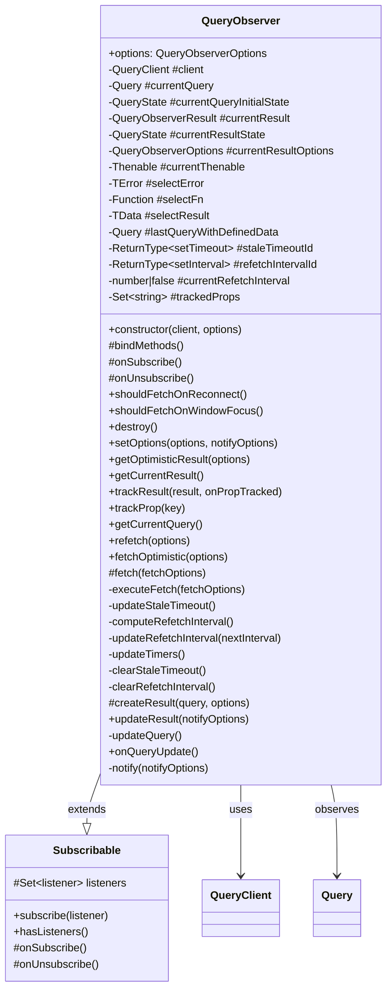

# 2.2 `QueryObserver` **基本概念与订阅**

`QueryObserver` 是 `query-core` 中连接底层数据状态 (`Query`) 与上层 UI 框架或订阅者的关键桥梁。它不直接获取数据，而是观察一个 `Query` 实例，并根据自身的配置选项计算出适合 UI 使用的结果状态 (`QueryObserverResult`)，同时负责触发数据更新和通知订阅者。

## 2.2.1 职责与作用 (连接 `Query` 与订阅者)

`QueryObserver` 的核心职责是将 `Query` 的内部状态转化为外部消费者可以直接使用的 `QueryObserverResult`。其主要作用包括：

1.  **状态监听**: 监听其关联 `Query` 实例的状态变化。 (通过 `Query.addObserver`)。
2.  **结果计算**: 根据 `Query` 状态和自身选项计算 `QueryObserverResult`。 (核心在 `createResult` 方法)。
3.  **数据转换**: 若配置了 `select` 函数，在 `Query` 获取到新数据后进行转换。
4.  **行为触发**: 根据选项和 `Query` 状态决定何时触发数据获取 (`fetch`)。
5.  **订阅与通知**: 管理订阅者 (`listeners`)，并在结果变化时通知。
6.  **生命周期管理**: 管理自身订阅和与 `Query` 的连接，清理资源。

以下是 `QueryObserver` 的完整类图表示：



## 2.2.2 实例化与订阅/取消订阅 (`subscribe`, `unsubscribe`)

`QueryObserver` 继承自 `Subscribable` 类，实现了标准的发布-订阅模式。

1.  **实例化**: 通过构造函数创建。

    ```typescript
    // packages/query-core/src/queryObserver.ts
    constructor(
      client: QueryClient,
      public options: QueryObserverOptions<...>
    ) {
      super() // 调用 Subscribable 的构造函数

      this.#client = client // 保存 QueryClient 引用
      this.#selectError = null
      this.#currentThenable = pendingThenable() // 初始化用于 Suspense 的 thenable
      // ... 初始化实验性特性检查 ...

      this.bindMethods() // 绑定 refetch 等方法到实例
      this.setOptions(options) // 初始化选项并触发初始查询/结果计算
    }
    ```

    **源码解析**: 构造函数接收 `QueryClient` 实例和初始 `options`。它初始化内部状态，绑定方法，最重要的是调用 `setOptions` 来完成初始设置（包括查找或构建 `Query` 实例，见 2.5.4 节）。

2.  **订阅 (`subscribe(listener)`)**: 由 `Subscribable` 基类提供。

    ```typescript
    // packages/query-core/src/subscribable.ts (简化示意)
    subscribe(listener: Listener): () => void {
      this.listeners.add(listener)
      this.onSubscribe() // 调用子类的 onSubscribe 钩子
      return () => {
        this.listeners.delete(listener)
        this.onUnsubscribe() // 调用子类的 onUnsubscribe 钩子
      }
    }
    ```

    **源码解析**: 调用 `subscribe` 会将监听器（通常是 UI 组件的更新函数）添加到内部 `listeners` 集合，并触发 `onSubscribe` 钩子。它返回一个 `unsubscribe` 函数，用于清理。

3.  **`onSubscribe` 钩子**: 当第一个监听器添加时被触发。

    ```typescript
    // packages/query-core/src/queryObserver.ts
    protected onSubscribe(): void {
      if (this.listeners.size === 1) { // 仅在第一个订阅者加入时执行
        this.#currentQuery.addObserver(this) // 将自身注册到 Query

        // 判断是否需要在挂载时获取数据
        if (shouldFetchOnMount(this.#currentQuery, this.options)) {
          this.#executeFetch() // 触发 fetch
        } else {
          this.updateResult() // 否则，至少更新一次结果
        }

        // 更新/启动后台定时器 (staleTime, refetchInterval)
        this.#updateTimers()
      }
    }
    ```

    **源码解析**: 这是建立 `QueryObserver` 和 `Query` 连接的关键点。它将观察者添加到 `Query`，调用 `shouldFetchOnMount` 决定是否立即获取数据，并调用 `#updateTimers` 来启动或更新相关的后台定时器（用于数据标记为 stale 或定期 refetch）。

4.  **`onUnsubscribe` 钩子**: 当最后一个监听器移除时被触发。

    ```typescript
    // packages/query-core/src/queryObserver.ts
    protected onUnsubscribe(): void {
      if (!this.hasListeners()) { // 确认没有监听者了
        this.destroy() // 调用销毁逻辑
      }
    }
    ```

5.  **销毁 (`destroy`)**: 清理资源。
    ```typescript
    // packages/query-core/src/queryObserver.ts
    destroy(): void {
      this.listeners = new Set() // 清空监听者
      this.#clearStaleTimeout() // 清除 stale 定时器
      this.#clearRefetchInterval() // 清除 interval 定时器
      this.#currentQuery.removeObserver(this) // 从 Query 移除自身
    }
    ```
    **源码解析**: `destroy` 方法负责彻底清理观察者，包括清除所有定时器和解除与 `Query` 的关联，防止内存泄漏。

## 2.2.3 触发查询的基本方式

`QueryObserver` 主要通过调用内部的 `#executeFetch()` 方法来触发关联 `Query` 的数据获取。以下是常见的触发路径：

1.  **首次订阅 (Mount)**: 如 `onSubscribe` 源码所示，当第一个订阅者加入且 `shouldFetchOnMount` 条件满足时，会调用 `#executeFetch()`。

    ```typescript
    // packages/query-core/src/queryObserver.ts (onSubscribe 内部)
    if (shouldFetchOnMount(this.#currentQuery, this.options)) {
      this.#executeFetch()
    }

    // packages/query-core/src/queryObserver.ts
    function shouldFetchOnMount(
      query: Query<any, any, any, any>,
      options: QueryObserverOptions<any, any, any, any, any>,
    ): boolean {
      return (
        // 条件1: 需要加载数据 (启用、无数据、非错误状态或允许 retryOnMount)
        shouldLoadOnMount(query, options) ||
        // 条件2: 已有数据，但需要根据 refetchOnMount 策略重新获取
        (query.state.data !== undefined &&
          shouldFetchOn(query, options, options.refetchOnMount))
      )
    }

    function shouldLoadOnMount(...): boolean { /* ... */ }
    // function shouldFetchOn(...): boolean { /* ... */ } // 内部判断 refetch* 选项
    ```

    **`shouldFetchOnMount` 源码解析**: 这个辅助函数判断在 `QueryObserver` 首次被订阅（通常对应组件挂载）时是否应该触发 `fetch`。它包含两个主要条件：

    - **需要加载 (`shouldLoadOnMount`)**: 如果查询是 `enabled` 的，当前没有数据 (`data === undefined`)，并且不是一个不允许 `retryOnMount` 的错误状态，则应该加载。
    - **需要重新获取 (基于 `refetchOnMount`)**: 如果查询已有数据 (`data !== undefined`)，会调用 `shouldFetchOn(query, options, options.refetchOnMount)` 来判断。
      - 如果 `refetchOnMount` 配置为 `'always'` (或函数返回 `'always'`)，则**总是**触发重新获取 (只要 `enabled`)。- 如果 `refetchOnMount` 配置为 `true` (或函数返回 `true`)，则**仅当数据过时 (`isStale`)** 时才触发重新获取 (且需 `enabled`)。
      - 如果 `refetchOnMount` 配置为 `false` (或函数返回 `false`)，则**不**触发重新获取。
        满足任一条件（需要加载 或 需要重新获取）即返回 `true`。

2.  **手动触发 (`refetch`)**: 调用 `QueryObserver` 实例上的 `refetch` 公共方法。

    ```typescript
    // packages/query-core/src/queryObserver.ts
    refetch({ ...options }: RefetchOptions = {}): Promise<QueryObserverResult<TData, TError>> {
      // fetch 是一个受保护的方法，内部调用 #executeFetch
      return this.fetch({
        ...options,
      })
    }

    protected fetch(fetchOptions: ObserverFetchOptions): Promise<...> {
      return this.#executeFetch({ ... }).then(() => {
        this.updateResult()
        return this.#currentResult
      })
    }
    ```

    **源码解析**: 公开的 `refetch` 方法是对内部 `fetch` 方法的封装，最终调用私有的 `#executeFetch` 来执行实际的获取逻辑，并在获取完成后更新结果。

3.  **选项变更 (`setOptions`)**: 当调用 `setOptions` 且满足特定条件时 (如切换到新的或过时的 `Query`)，也会调用 `#executeFetch()`。详见 2.5.4 节。

4.  **其他自动触发**: 例如，当窗口重新获得焦点 (`refetchOnWindowFocus`) 或网络重新连接 (`refetchOnReconnect`) 时，如果条件满足 (`shouldFetchOn...` 返回 `true`)，`QueryClient` 会通知 `QueryCache`，最终可能导致相关 `QueryObserver` 通过其关联的 `Query` 触发 `#executeFetch()`。同样，`refetchInterval` 定时器到期时也会直接调用 `#executeFetch()`。这些将在后续章节详细分析。

### 2.2.4 内部定时器管理 (#updateTimers)

`QueryObserver` 内部通过 `#updateTimers` 方法来协调管理两个重要的后台定时器：`staleTimeout` 和 `refetchInterval`。这个方法在关键的时机被调用（如 `onSubscribe` 和 `onQueryUpdate`），以确保定时器与当前的查询状态和观察者选项保持同步。

```typescript
// packages/query-core/src/queryObserver.ts
#updateTimers(): void {
  this.#updateStaleTimeout() // 更新数据过期定时器
  this.#updateRefetchInterval(this.#computeRefetchInterval()) // 更新定期重新获取定时器
}
```

**源码解析**:

- `#updateTimers` 本身逻辑非常简单，它只是调用了两个更具体的内部方法：
  - `#updateStaleTimeout`: 负责根据 `staleTime` 选项设置或清除一个超时计时器。当计时器到期时，如果结果尚未 `stale`，它会调用 `updateResult` 来将结果标记为 `stale`。
  - `#updateRefetchInterval`: 负责根据 `refetchInterval` 选项启动、停止或更新一个周期性计时器。当计时器触发时，它会调用 `#executeFetch` 来执行后台数据刷新。
- 通过这种方式，`#updateTimers` 确保了 `QueryObserver` 能够根据最新的配置和状态来管理数据的新鲜度标记和自动重新获取行为。
- 这两个定时器的具体实现细节将在后续章节（3.2 `staleTime` 和 5.1 `refetchInterval`）中深入分析。
